# Guild Management Database Schema

Complete D1 (SQLite) database structure with all tables, relationships, and indexes.

## Entity Relationship Diagram

```mermaid
erDiagram
  users ||--o| user_auth_password : has_auth
  users ||--o{ sessions : has_sessions
  users ||--o{ api_keys : has_api_keys
  users ||--o| member_profiles : has_profile
  users ||--o{ member_notes : has_notes
  users ||--o| member_qishu : has_qishu
  users ||--o| member_xinfa : has_xinfa
  users ||--o| member_wuxue : has_wuxue
  users ||--o{ member_classes : has_classes
  users ||--o{ member_availability_blocks : has_availability
  users ||--o{ member_media : has_media
  users ||--o{ announcements : creates
  users ||--o{ events : creates
  users ||--o{ team_members : belongs_to
  users ||--o{ war_member_stats : has_stats
  users ||--o{ audit_log : acts

  media_objects ||--o{ media_conversions : has_conversions
  media_objects ||--o{ member_media : linked_to_member
  media_objects ||--o{ announcement_media : attached_to_announcement
  media_objects ||--o{ event_attachments : attached_to_event

  announcements ||--o{ announcement_media : has_media

  events ||--o{ event_attachments : has_attachments
  events ||--o{ event_teams : has_assigned_teams
  events ||--o| war_history : war_record

  teams ||--o{ team_members : has_members
  teams ||--o{ event_teams : assigned_to

  war_history ||--o{ war_member_stats : has_member_stats

  users {
    TEXT user_id PK
    TEXT username
    TEXT wechat_name
    TEXT role
    INTEGER power
    INTEGER is_active
    TEXT last_username_change_at_utc
    TEXT deleted_at_utc
    TEXT created_at_utc
    TEXT updated_at_utc
  }

  user_auth_password {
    TEXT user_id PK
    TEXT password_hash
    TEXT salt
    TEXT updated_at_utc
    TEXT created_at_utc
  }

  sessions {
    TEXT session_id PK
    TEXT user_id
    TEXT csrf_token
    TEXT created_at_utc
    TEXT last_used_at_utc
    TEXT expires_at_utc
    TEXT revoked_at_utc
    TEXT user_agent
    TEXT ip_hash
    TEXT updated_at_utc
  }

  api_keys {
    TEXT key_id PK
    TEXT user_id
    TEXT key_hash
    TEXT key_prefix
    TEXT name
    TEXT scopes
    INTEGER is_active
    TEXT last_used_at_utc
    TEXT expires_at_utc
    TEXT created_at_utc
  }

  member_profiles {
    TEXT user_id PK
    TEXT title_html
    TEXT bio_text
    TEXT vacation_start_at_utc
    TEXT vacation_end_at_utc
    TEXT created_at_utc
    TEXT updated_at_utc
  }

  member_notes {
    TEXT user_id PK
    INTEGER slot PK
    TEXT note_text
    TEXT created_by
    TEXT updated_by
    TEXT created_at_utc
    TEXT updated_at_utc
  }

  member_qishu {
    TEXT user_id PK
    TEXT created_at_utc
    TEXT updated_at_utc
    INTEGER shihouzhengsheng
    INTEGER jinchantengyue
    INTEGER yanjiushi
    INTEGER baiguidaxueshou
    INTEGER weituozhengfa
    INTEGER liuxingzhuihuo
    INTEGER xiaoyinqianlang
    INTEGER yingzhaolianzao
    INTEGER yaochapomo
    INTEGER zizaiwuai
    INTEGER gouzuiduoshi
    INTEGER qilonghuima
    INTEGER shenlongtuhuo
    INTEGER taibaizuiyue
    INTEGER yelongxiangshou
    INTEGER wanwuweifeng
    INTEGER hongchenzhangmu
    INTEGER qingfengjiyue
    INTEGER wuxiangjinshen
    INTEGER yinyangmizongbu
    INTEGER yiezhiming
    INTEGER yingguanghuiye
    INTEGER yaowuxing
  }

  member_xinfa {
    TEXT user_id PK
    TEXT created_at_utc
    TEXT updated_at_utc
    INTEGER yishuige
    INTEGER huashangyueling
    INTEGER junchenyao
    INTEGER sishiwuchang
    INTEGER wumingxinfa
    INTEGER jianqizongheng
    INTEGER shanhejieyun
    INTEGER wangchuanjuexiang
    INTEGER qianyingyihu
    INTEGER shuangtianbaiye
    INTEGER fuyaozhishang
    INTEGER zhengrengui
    INTEGER nuzhanma
    INTEGER hulufeifei
    INTEGER chunleipian
    INTEGER xinghuabujian
    INTEGER qiansigu
    INTEGER weimengge
    INTEGER duanshizhigou
    INTEGER sanqiongzhizhi
    INTEGER suohenniannian
    INTEGER guiyanjing
    INTEGER changshengwuxiang
    INTEGER posuoying
    INTEGER minghuitongchen
    INTEGER danxinzhuan
    INTEGER qianshanfa
    INTEGER liaoyuanxinghuo
    INTEGER zhulangxinjing
    INTEGER yijingyiwu
    INTEGER ningshenzhang
    INTEGER zongdizhaixing
    INTEGER zhixuanpianzhu
    INTEGER kunshouxinjing
    INTEGER kangzaodafa
    INTEGER panshijue
    INTEGER xinminiyu
    INTEGER canglangjianjue
    INTEGER shengzhouxingmu
    INTEGER dengerliang
    INTEGER datangge
    INTEGER guzhongbuci
    INTEGER chuanhoujue
    INTEGER liaoyuenta
    INTEGER qiantianshi
    INTEGER tianxingjian
    INTEGER jileqixue
    INTEGER shanyuewuying
    INTEGER shenglonghuohu
    INTEGER wanxuejian
    INTEGER tieshenjue
    INTEGER shabaiwei
  }

  member_wuxue {
    TEXT user_id PK
    TEXT created_at_utc
    TEXT updated_at_utc
    INTEGER shanghaijiacheng
    INTEGER shoushangjianmian
    INTEGER qixuejiacheng
    INTEGER mingjingongjijiacheng
    INTEGER lieshigongjijiacheng
    INTEGER qiansigongjijiacheng
    INTEGER pozhugongjijiacheng
    INTEGER tuji
    INTEGER gushou
    INTEGER shenxing
    INTEGER fengzu
    INTEGER tongqiangtiebie
    INTEGER jiuqujingshenqiang
    INTEGER jiuchongchunse
    INTEGER bafangfengleiqiang
    INTEGER shifangpozhen
    INTEGER qianjisutian
    INTEGER qianxiangyinhungu
    INTEGER jiefudaofa
    INTEGER tianzhichuixiang
    INTEGER zhanxuedaofa
    INTEGER wumingjianfa
    INTEGER wumingqiangfa
    INTEGER mingchuanyaodian
    INTEGER nilisangou
    INTEGER jijujiujian
    INTEGER suziyouchen
    INTEGER suzixingyun
    INTEGER zuimengyouchun
    INTEGER qingshanzhibi
  }

  member_classes {
    TEXT user_id PK
    TEXT class_code PK
    INTEGER sort_order
    TEXT created_at_utc
    TEXT updated_at_utc
  }

  member_availability_blocks {
    TEXT block_id PK
    TEXT user_id
    INTEGER weekday
    INTEGER start_min
    INTEGER end_min
    TEXT created_at_utc
    TEXT updated_at_utc
  }

  media_objects {
    TEXT media_id PK
    TEXT storage_type
    TEXT r2_key
    TEXT url
    TEXT content_type
    INTEGER size_bytes
    INTEGER width
    INTEGER height
    INTEGER duration_ms
    TEXT sha256
    TEXT created_by
    TEXT created_at_utc
    TEXT updated_at_utc
  }

  media_conversions {
    TEXT conversion_id PK
    TEXT media_id
    TEXT original_key
    TEXT converted_key
    TEXT target_format
    TEXT status
    INTEGER progress_percent
    TEXT error_message
    TEXT created_at_utc
    TEXT updated_at_utc
    TEXT completed_at_utc
  }

  member_media {
    TEXT user_id PK
    TEXT media_id PK
    TEXT kind
    INTEGER is_avatar
    INTEGER sort_order
    TEXT created_at_utc
    TEXT updated_at_utc
  }

  announcements {
    TEXT announcement_id PK
    TEXT title
    TEXT body_html
    INTEGER is_pinned
    INTEGER is_archived
    TEXT deleted_at_utc
    TEXT created_by
    TEXT updated_by
    TEXT created_at_utc
    TEXT updated_at_utc
    TEXT archived_at_utc
  }

  announcement_media {
    TEXT announcement_id PK
    TEXT media_id PK
    INTEGER sort_order
    TEXT created_at_utc
    TEXT updated_at_utc
  }

  events {
    TEXT event_id PK
    TEXT type
    TEXT title
    TEXT description
    TEXT start_at_utc
    TEXT end_at_utc
    INTEGER capacity
    INTEGER is_pinned
    INTEGER is_archived
    INTEGER signup_locked
    TEXT deleted_at_utc
    TEXT created_by
    TEXT updated_by
    TEXT created_at_utc
    TEXT updated_at_utc
    TEXT archived_at_utc
  }

  event_participants {
    TEXT event_id PK
    TEXT user_id PK
    TEXT joined_at_utc
    TEXT joined_by
    TEXT created_at_utc
    TEXT updated_at_utc
  }

  event_attachments {
    TEXT attachment_id PK
    TEXT event_id
    TEXT media_id
    INTEGER sort_order
    TEXT created_at_utc
    TEXT updated_at_utc
  }

  teams {
    TEXT team_id PK
    TEXT name
    TEXT description
    INTEGER is_locked
    TEXT created_at_utc
    TEXT updated_at_utc
  }

  team_members {
    TEXT team_id PK
    TEXT user_id PK
    INTEGER sort_order
    TEXT role_tag
    TEXT joined_at_utc
  }

  event_teams {
    TEXT event_id PK
    TEXT team_id PK
    TEXT assigned_at_utc
  }

  war_history {
    TEXT war_id PK
    TEXT event_id
    TEXT war_date
    TEXT title
    TEXT notes
    INTEGER our_kills
    INTEGER enemy_kills
    INTEGER our_towers
    INTEGER enemy_towers
    INTEGER our_base_hp
    INTEGER enemy_base_hp
    INTEGER our_distance
    INTEGER enemy_distance
    INTEGER our_credits
    INTEGER enemy_credits
    TEXT result
    TEXT created_by
    TEXT updated_by
    TEXT created_at_utc
    TEXT updated_at_utc
  }

  war_member_stats {
    TEXT war_id PK
    TEXT user_id PK
    TEXT role_tag
    INTEGER kills
    INTEGER deaths
    INTEGER assists
    INTEGER damage
    INTEGER healing
    INTEGER building_damage
    INTEGER damage_taken
    INTEGER credits
    TEXT note
    TEXT created_at_utc
    TEXT updated_at_utc
  }

  audit_log {
    TEXT audit_id PK
    TEXT entity_type
    TEXT action
    TEXT actor_id
    TEXT entity_id
    TEXT diff_title
    TEXT detail_text
    TEXT created_at_utc
    TEXT updated_at_utc
  }

  member_progression {
    TEXT user_id PK
    TEXT category PK
    TEXT item_id PK
    INTEGER level
    INTEGER max_level
    TEXT created_at_utc
    TEXT updated_at_utc
  }

```

## Table Categories

### 🔐 Authentication & Security (4 tables)
- `users` - User accounts with soft delete
- `sessions` - Active sessions with CSRF tokens
- `api_keys` - API keys for programmatic access
- `user_auth_password` - Password hashes

### 👤 Member Profiles & Progression (8 tables)
- `member_profiles` - Bio, vacation, title
- `member_notes` - 5 admin note slots (admin-only)
- `member_classes` - Ordered class list
- `member_qishu` - Qishu progression (23 skills)
- `member_xinfa` - Xinfa progression (51 skills)
- `member_wuxue` - Wuxue progression (23 skills)
- `member_progression` - Flexible progression (jingmai, juexing, shenbing, lingmai)
- `member_availability_blocks` - Weekly availability

### 📁 Media System (5 tables)
- `media_objects` - R2 files + external URLs
- `media_conversions` - WebP/Opus conversion tracking
- `member_media` - User images/audio/videos
- `announcement_media` - Announcement attachments
- `event_attachments` - Event attachments

### 📢 Announcements (2 tables)
- `announcements` - With soft delete & indexes
- `announcement_media` - Media attachments

### 📅 Events (3 tables)
- `events` - With soft delete & indexes
- `event_teams` - Team assignments
- `event_attachments` - Media

### 🛡️ Teams (2 tables)
- `teams` - Universal team definitions
- `team_members` - Team rosters

### ⚔️ Guild War (2 tables)
- `war_history` - War records
- `war_member_stats` - Individual stats

### 📋 Audit (1 table)
- `audit_log` - All entity changes

## Key Features

### Soft Delete Support
- `users.deleted_at_utc`
- `announcements.deleted_at_utc`
- `events.deleted_at_utc`
- Enables 30-second undo window

### Performance Indexes
- **Batch operations**: Direct ID lookups
- **Push polling**: `updated_at_utc DESC` indexes
- **List endpoints**: Multi-column covering indexes
- **Auth**: Username and token indexes

### Security
- CSRF tokens in sessions
- API key SHA-256 hashing
- Scoped API permissions
- Soft deletes with cleanup indexes

### Constraints
- Foreign keys with CASCADE/SET NULL
- CHECK constraints for enums
- UNIQUE indexes for quotas
- Triggers for business rules

## Total Tables: 30

**By Category:**
- Authentication & Security: 4
- Member Profiles & Progression: 8
- Media System: 5
- Announcements: 2
- Events: 3
- Guild War: 5
- Audit: 1
- Flexible Progression: 1
